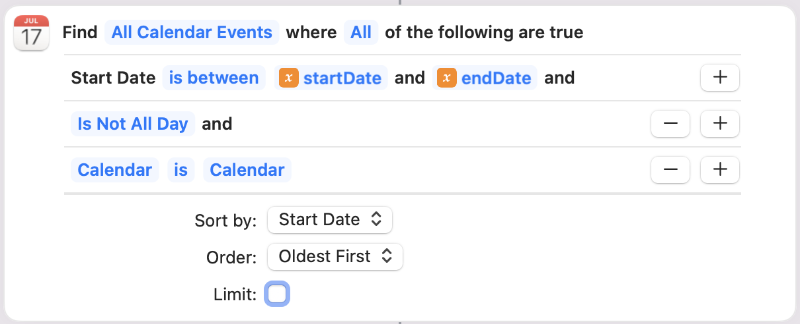

# fillInWhen2Meet

`fillInWhen2Meet` is a [Julia](https://julialang.org) program that uses [Selenium](https://www.selenium.dev) and [ChromeDriver](https://chromedriver.chromium.org) along with a Mac [Shortcut](https://support.apple.com/guide/shortcuts-mac/intro-to-shortcuts-apdf22b0444c/mac) to automatically fill in a [When2Meet](https://www.when2meet.com) poll marking times you are available according to your calendar. You are then free to adjust the poll after the fill-in.

Skip to instructions for  [Running](#running).

## What you will need

- A Mac
- The calendar(s) you want to use need to be accessible from the Mac Calendar program
- Chrome installed on your Mac

If you want to follow the installation instructions here, you will also need
- [Homebrew](https://brew.sh) installed
- [Anaconda](https://www.anaconda.com), [Miniconda](https://docs.conda.io/en/latest/miniconda.html), or [Miniforge](https://github.com/conda-forge/miniforge) installed (e.g. an Anaconda-like python installation)

## Installation

You will need to install Julia, the Selenium Python library, and the ChromeDriver executable. You'll then need to clone this repository, instantiate the Julia environment here, and install the included `find-busy-times` Shortcut. All of these steps are explained below. You should only need to do them once.

### Install Julia
Download the [Julia](https://julialang.org/downloads/) executable appropriate for your Mac. The *M-series* executable works well on the newer Macs. As of this writing, Julia was at v1.8.1.

Note that to make running Julia easy, I set up a softlink...
```bash
sudo ln -sf /Applications/Julia-1.8.app/Contents/Resources/julia/bin/julia /usr/local/bin/julia
```

With that, you just type `julia` on the commnad line.

Note that you'll need to re-do this soft link when Julia goes to the next major version, like `v1.9`. You don't need to change this for minor updates, like when `v1.8.2` comes out.

### Install Selenium and Chrome Driver

In a Mac terminal (assuming you have an Ananconda-like Python installation and Homebrew)...

```bash
conda install selenium
brew install chromedriver
```

Note that the `chromedriver` executable downloaded from the [ChromeDriver](https://chromedriver.chromium.org) web page seems to be unsigned and won't work on your Mac. The installation from Homebrew works just fine.

### Clone this repository

Go to a directory where you keep such scripts and do

```bash
git clone https://github.com/lyon-fnal/fillInWhen2Meet.git
```

`cd` into the new repository directory.

### Instantiate the Julia environment

From the command line, do `which python` (assuming it is the python used by your conda environment) and remember the answer. When we instantiate the Julia environment, we will need to tell Julia where your anaconda-like python installation is with this path.

Start Julia from the command line with

```bash
julia --project
```

The `--project` is important as it tells Julia to use the environment defined by the `Project.toml` and `Manifest.toml` files in the directory. Maybe one day the Julia authors will make a shorter command-line option.

Once Julia has started, type in
```julia
ENV["PYTHON"] = "<path to python>"
```
Where `<path to python>` is what you copied from the `which python` command above.

Then, still within Julia, do
```julia
]
instantiate
build PyCall
<Backspace Key>
```

The `]` puts Julia into "Package mode". The `instantiate` will look at the enviroment definition and download and install the packages you need. `build PyCall` will ensure that the `PyCall.jl` library will use your Anaconda-like installation of python (the `instantiate` command will likely do that, but it doesn't hurt to build it again manually). Finally, pressing the `<Backspace key>` on a new line will exit Package mode.

You can leave Julia with `Control-D`.

### Install the `find-busy-times` shortcut

From the command line and within the repository directory, do
```bash
open find-busy-times.shortcut
```

That should pop a window asking to add the shortcut. Note that the shortcut "Receives What's on Screen" in order to input the date that you want to search. No data from your screen is actually used.

Add the shortcut and open it in the Shortcuts app by double clicking on it.

Scroll down to the cell that looks like 

You should change the query to reflect the calendars you want to use when filling in When2Meet. You should keep the `Is Not All day` item.

When done, then close the Shortcut window.

### Adjusting the time zone
If you are in the US Central time zone, then you don't need to do anything. If you are in a different time zone, then edit the `fillInWhen2Meet.jl` file, and around line 109, change `tz"America/Chicago"` to the identifier appropriate to your time zone, like `tz"America/New_York"`, `tz"America/Los_Angeles"`, or `tz"Antarctica/Troll"`. See [here](https://en.wikipedia.org/wiki/List_of_tz_database_time_zones) for the full list.

## Running

Assuming you've followed all of the installation instructions above, you should `cd` to the respository directory and do,

```bash
julia --project fillInWhen2Meet.jl
```

Within a few seconds, the automated Chrome browser should appear. You should also see a message in the terminal window telling you to navigate to When2Meet and sign in.

If you've been given a URL for a poll, copy and paste that into the automated Chrome's URL box (replace `data:,`). Otherwise, enter `when2meet.com` and set up a poll. You can do specific dates or days of the week. When it is set up, then click `Create Event`. Then sign in on the page that appears.

Note that the password is optional. If you do fill one in, then that will allow you to change your availability later (use the same name and password as before). You can then update your availabiility if your calendar changes. Note that you should not run this script again on a filled in poll. It will likley reverse your availability! If you choose to run the script again, before allowing it to continue clear out your availability (e.g. make yourself completely unavailable).

Once you've signed in, you should see the availability grid on the left side of the screen. Now go back to the terminal window and press `ENTER` to continue the Julia program.

The program will check your calendar for the necessary days and will mark times that you are available. Once the program completes, you can make any changes you need to the poll. Note that the script will not mark day-long events (e.g. an event without times).

If the poll is for days of the week instead of specific days, the program will use your calendar for the current week. You will need to make manual adjustments if this week is not representitive of your normal calendar.

## Why didn't you...

- ... use SafariDriver instead of ChromeDriver? Indeed `safaridriver` is already installed on all Macs, but Safari in automated mode does not allow for user input and interaction like automated Chrome does. Thus, automated Safari does not easily allow the user to navigate to the When2Meet page and sign in.

- ... use Python instead of Julia? My brain only maintains one scripting language at a time, and for quite awhile it's been Julia. I think it has some very nice features and great documentation.

- ... use [WebDriver.jl](https://github.com/Nosferican/WebDriver.jl)? I couldn't get it to work. Using the selenium python library with Julia's [PyCall.jl](https://github.com/JuliaPy/PyCall.jl) package is quite easy.